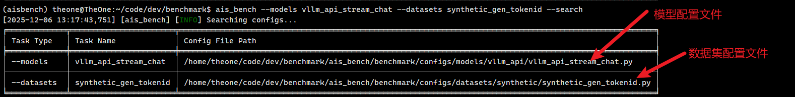
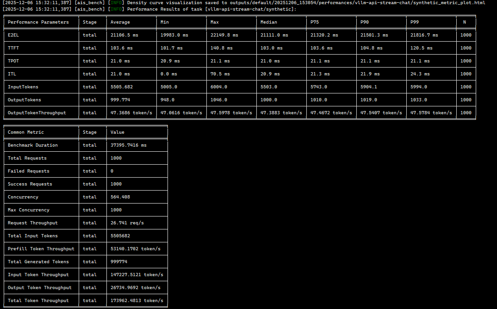
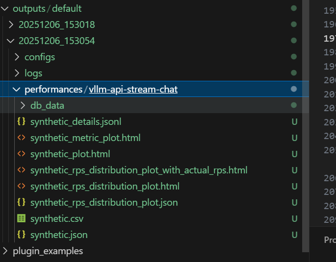
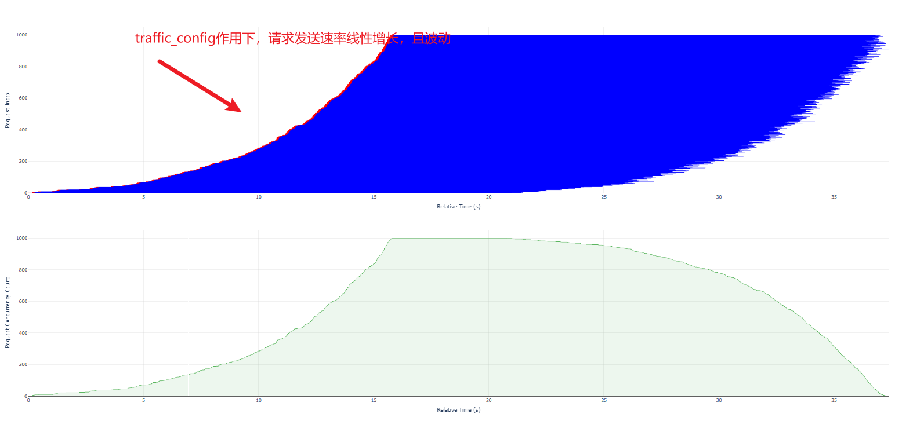
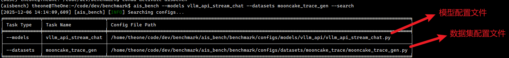
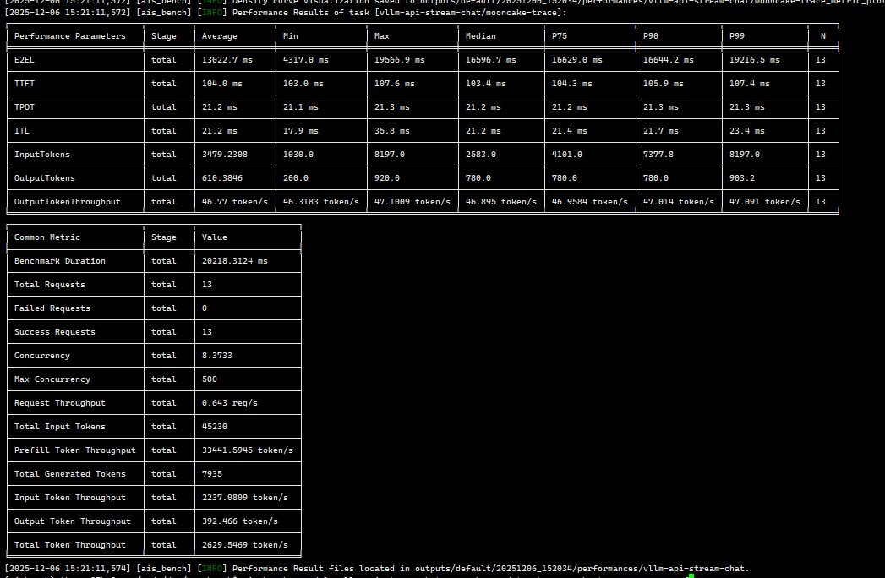
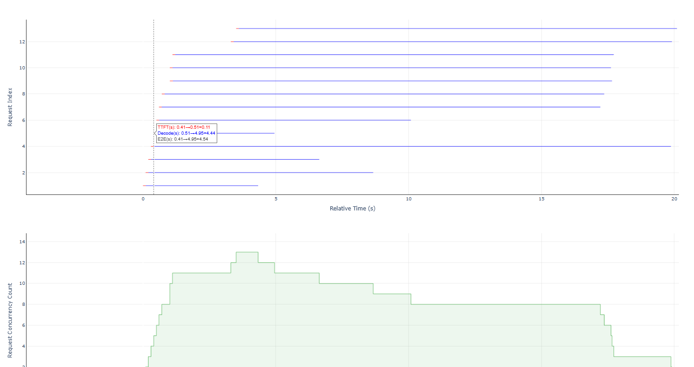

# Benchmark 使用指南

## 环境安装

### 前置要求

- Python 版本 >= 3.10

### 安装步骤

1. **克隆仓库**

   当前特性仅在私有仓库适配，后续将视情况合入主仓库：

   ```shell
   git clone https://github.com/GaoHuaZhang/benchmark.git
   ```

2. **切换分支**

   ```shell
   git checkout synthetic_prefix
   ```

3. **安装 aisbench**

   ```shell
   pip install -e ./ --use-pep517
   ```

4. **验证安装**

   执行以下命令验证是否安装成功：

   ```shell
   ais_bench -h
   ```

   如果能够正常显示帮助信息，则说明安装成功。

---

## 测试场景说明

本文档将针对以下两种测试场景进行详细说明：

1. **场景 1：随机数据分布 + 参数流控** - 适用于需要模拟真实业务流量控制的场景
2. **场景 2：指定每条请求输入输出长度 + 精确时间控制** - 适用于需要按照真实业务 trace 进行性能测试的场景

---

## 场景 1：随机数据分布 + 参数流控

### 场景概述

该场景通过配置模型的 `request_rate` 和 `traffic_config` 参数来控制整体的请求发送速度，适用于需要模拟真实业务场景下流量控制的测试需求。

### 核心参数说明

```python
models = [
    dict(
        # ... 其他参数
        request_rate=100,  # 请求速率（每秒发送请求个数）
        traffic_cfg=dict(  # 流量控制参数
            burstiness=0.5,
            ramp_up_strategy="linear",
            ramp_up_start_rps=10,
            ramp_up_end_rps=200,
        ),
        # ... 其他参数
    )
]
```

#### 参数详解

- **`request_rate`**: 每秒发送请求个数
  - 默认值：`0`（表示不限制发送速率，尽可能快速发送）
  - 示例：`100` 表示每秒发送 100 个请求

- **`traffic_cfg`**: 流量控制配置，用于控制 `request_rate` 的整体分布
  - 作用：使请求发送不是完全均匀，模拟真实业务场景下的流量抖动和流控
  - **`burstiness`**: 突发性因子
    - 默认值：`0`（不突发）
    - 取值范围：`0` 到 `1`
    - `1` 表示突发性最大，`0` 表示不突发
  - **`ramp_up_strategy`**: 爬升策略 配置时次啊用动态request_rate,如果配置了ramp_up_strategy，则request_rate不再生效
    - 默认值：`"linear"`（线性爬升）
    - 可选值：`"linear"`（线性）或 `"exponential"`（指数）
  - **`ramp_up_start_rps`**: 爬升起始速率
    - 默认值：`0`（不启用爬升）
  - **`ramp_up_end_rps`**: 爬升终止速率
    - 默认值：`0`（不启用爬升）

> **提示**：还可以控制动态调整 `request_rate`，详细参数配置请参考：[RPS 分布配置文档](https://ais-bench-benchmark-rf.readthedocs.io/zh-cn/latest/advanced_tutorials/rps_distribution.html#id4)

### 使用说明

#### 1. 参数配置

**步骤 1：查找配置文件**

安装好 aisbench 之后，执行以下命令查看配置文件路径：

```shell
ais_bench --models vllm_api_stream_chat --datasets synthetic_gen_tokenid --search
```

执行后会显示配置文件的绝对路径，如下图所示：



**步骤 2：修改模型配置文件**

修改模型配置文件 `ais_bench/benchmark/configs/models/vllm_api/vllm_api_stream_chat.py`，指定 `request_rate` 为 100（每秒发送 100 个请求）：

```python
from ais_bench.benchmark.models import VLLMCustomAPIChat
from ais_bench.benchmark.utils.postprocess.model_postprocessors import extract_non_reasoning_content

models = [
    dict(
        attr="service",
        type=VLLMCustomAPIChat,  # 模型类型，不要修改
        abbr="vllm-api-stream-chat",  # 模型唯一标识，按需修改，影响结果保存路径
        path="",  # 模型词表文件，本地没有可去 HuggingFace 下载一个到本地
        model="",  # 服务端模型 ID
        stream=True,  # 流式接口，不要修改
        request_rate=100,  # 每秒发送 100 个请求
        retry=2,  # 失败请求重试次数
        api_key="",  # 自定义 API Key，默认为空，访问公网服务时需要配置
        host_ip="localhost",  # 服务端 IP
        host_port=8080,  # 服务端端口
        url="",  # 自定义 URL，默认为空，访问公网服务或 IPv6 服务时需要配置，会覆盖 host_ip 和 host_port
        max_out_len=512,  # 输出最大长度（自定义数据集下不生效，以每个样本的输出长度为准）
        batch_size=100,  # 最大并发数，达到后后续请求将等待，直到有请求完成
        trust_remote_code=False,  # 是否信任远程代码，默认 False
        traffic_cfg=dict(
            burstiness=0.5,  # 突发性因子，默认为 0，表示不突发，取值范围为 0 到 1
            ramp_up_strategy="linear",  # 爬升策略，默认为 "linear"，可选值为 "linear" 和 "exponential"
            ramp_up_start_rps=10,  # 爬升起始速率，默认为 0，表示不爬升
            ramp_up_end_rps=200,  # 爬升终止速率，默认为 0，表示不爬升
        ),
        generation_kwargs=dict(
            ignore_eos=True,  # 开启 ignore_eos，确保输出长度达到指定的输出长度
        ),
        pred_postprocessor=dict(type=extract_non_reasoning_content),  # 预测后处理，用于提取非推理内容，性能模式下无需关注
    )
]
```

**步骤 3：修改数据集配置文件**

修改数据集配置文件 `ais_bench/benchmark/configs/datasets/synthetic_gen_tokenid.py`，指定随机生成的请求个数以及输入输出分布：

```python
synthetic_config = {
    "Type": "tokenid",  # 数据集类型，不要修改
    "RequestCount": 100,  # 随机生成的请求个数
    "TrustRemoteCode": False,  # 是否信任远程代码，默认为 False
    "TokenIdConfig": {
        "Input": {
            "Method": "uniform",  # 输入分布，默认为均匀分布，可指定为 gaussian（高斯分布）或 zipf（齐夫分布）
            # 详情参考：https://ais-bench-benchmark-rf.readthedocs.io/zh-cn/latest/advanced_tutorials/synthetic_dataset.html#id8
            "Params": {"MinValue": 5000, "MaxValue": 6000}
        },
        "Output": {
            "Method": "gaussian",  # 输出分布，默认为高斯分布，可指定为均匀分布或 zipf（齐夫分布）
            # 详情参考：https://ais-bench-benchmark-rf.readthedocs.io/zh-cn/latest/advanced_tutorials/synthetic_dataset.html#id8
            "Params": {"Mean": 1000, "Var": 200, "MinValue": 500, "MaxValue": 1500}
        },
        "PrefixLen": 0.6  # 公共前缀长度，默认为 0（不使用公共前缀）
        # 0.0-1.0 表示输入中有 PrefixLen * 100% 的 tokenid 是公共前缀
        # >1 表示固定长度为 PrefixLen 的公共前缀
    },
}
```

#### 2. 执行测试

配置完成后，执行以下命令开始测试：

```shell
ais_bench --models vllm_api_stream_chat --datasets synthetic_gen_tokenid --mode perf
```

> **注意**：由于数据生成需要进行 encode 和 decode，前处理根据 CPU 能力不同，可能存在较大耗时，请耐心等待。

测试完成后，会打印性能指标，如下图所示：



#### 3. 结果分析

任务结束后，会在 `outputs` 目录下生成如下结果：



**结果文件说明**：

- **`vllm-api-stream-chat/`**: 模型 `abbr` 对应的测评结果目录，对应模型配置文件中的 `abbr` 参数
- **`synthetic_metric_plot.html`**: 数据分布曲线，包含 TTFT、TPOT、输入输出 Token 长度的分布，下载到本地用浏览器查看
- **`synthetic_plot.html`**: 并发可视化图，可以查看每条请求的发送和结束时间，以及爬坡曲线，下载到本地用浏览器查看
  - 详细介绍可参考：[性能可视化文档](https://ais-bench-benchmark-rf.readthedocs.io/zh-cn/latest/base_tutorials/results_intro/performance_visualization.html#id1)



- **`synthetic_rps_distribution_plot.html`**: 请求速率分布曲线，可以查看请求速率分布情况，下载到本地用浏览器查看
  - 详细介绍可参考：[请求速率分布可视化文档](https://ais-bench-benchmark-rf.readthedocs.io/zh-cn/latest/advanced_tutorials/rps_distribution.html#id4)


## 场景 2：指定每条请求输入输出长度 + 精确时间控制

### 场景概述

该场景通过自定义数据集来指定每条请求的输入输出长度，并精确控制请求发送时间。适用于需要按照真实业务 trace 进行性能测试的场景。

### 数据集格式

原始数据需要用户自行生成，数据集格式为 JSONL（每行一个 JSON 对象），每条请求包含以下字段：

- **`timestamp`**: 请求发送时间（单位：毫秒）
- **`input_length`**: 请求输入长度（Token 数）
- **`output_length`**: 请求输出长度（Token 数）

**示例**：

```json
{"timestamp": 0, "input_length": 1024, "output_length": 27}
{"timestamp": 1000, "input_length": 2048, "output_length": 28}
{"timestamp": 2000, "input_length": 4096, "output_length": 29}
{"timestamp": 3000, "input_length": 8192, "output_length": 30}
```

### 使用说明

#### 1. 参数配置

**步骤 1：查找配置文件**

安装好 aisbench 之后，执行以下命令查看配置文件路径：

```shell
ais_bench --models vllm_api_stream_chat --datasets mooncake_trace_gen --search
```

执行后会显示配置文件的绝对路径，如下图所示：



**步骤 2：修改模型配置文件**

修改模型配置文件 `ais_bench/benchmark/configs/models/vllm_api/vllm_api_stream_chat.py`：

- 指定 `batch_size` 为 100（最大并发数，达到后后续请求将等待，直到有请求完成）
- **不要配置 `request_rate`**，系统会根据每条请求的 `timestamp` 进行精确时间控制发送

```python
from ais_bench.benchmark.models import VLLMCustomAPIChat
from ais_bench.benchmark.utils.postprocess.model_postprocessors import extract_non_reasoning_content

models = [
    dict(
        attr="service",
        type=VLLMCustomAPIChat,  # 模型类型，不要修改
        abbr="vllm-api-stream-chat",  # 模型唯一标识，按需修改，影响结果保存路径
        path="",  # 模型词表文件，本地没有可去 HuggingFace 下载一个到本地
        model="",  # 服务端模型 ID
        stream=True,  # 流式接口，不要修改
        request_rate=0,  # ⚠️ 该场景请求速率不要配置！必须设置为 0
        retry=2,  # 失败请求重试次数
        api_key="",  # 自定义 API Key，默认为空，访问公网服务时需要配置
        host_ip="localhost",  # 服务端 IP
        host_port=8080,  # 服务端端口
        url="",  # 自定义 URL，默认为空，访问公网服务或 IPv6 服务时需要配置，会覆盖 host_ip 和 host_port
        max_out_len=512,  # 输出最大长度（自定义数据集下不生效，以每个样本的输出长度为准）
        batch_size=100,  # 最大并发数，达到后后续请求将等待，直到有请求完成
        trust_remote_code=False,  # 是否信任远程代码，默认 False
        generation_kwargs=dict(
            ignore_eos=True,  # 开启 ignore_eos，确保输出长度达到指定的输出长度
        ),
        pred_postprocessor=dict(type=extract_non_reasoning_content),  # 预测后处理，用于提取非推理内容，性能模式下无需关注
    )
]
```

**步骤 3：修改数据集配置文件**

修改数据集配置文件 `ais_bench/benchmark/configs/datasets/mooncake_trace_gen.py`，指定每条请求的输入输出长度：

```python
mooncake_trace_datasets = [
    dict(
        abbr='mooncake-trace',
        type=MooncakeTraceDataset,
        path='',  # 原始数据集路径，使用相对路径时相对于源码根路径，支持绝对路径
        prefix_ratio=0.6,  # 公共前缀比例，默认为 0（不使用公共前缀）
        # 0.0-1.0 表示输入中有 prefix_ratio * 100% 的 tokenid 是公共前缀
        generated_prompts_path='',  # 生成的 prompt 缓存路径
        # 使用相对路径时相对于源码根路径，支持绝对路径
        # 默认保存在 path 目录下，检测到已经生成则会复用，只有第一次测评时生成
        reader_cfg=mooncake_trace_reader_cfg,
        infer_cfg=mooncake_trace_infer_cfg,
        eval_cfg=mooncake_trace_eval_cfg
    )
]
```

#### 2. 执行测试

配置完成后，执行以下命令开始测试：

```shell
ais_bench --models vllm_api_stream_chat --datasets mooncake_trace_gen --mode perf
```

> **注意**：
> - 由于数据生成需要进行 encode 和 decode，前处理根据 CPU 能力不同，可能存在较大耗时，请耐心等待
> - 由于 Chat 模型会拼接 role 信息，因此实际的输入 token 长度比设置的要大一些，可以减少配置中的 `input_length`，使其更接近实际的输入 token 长度

测试完成后，会打印性能指标，如下图所示：



#### 3. 结果分析

任务结束后，会在 `outputs` 目录下生成如下结果：

**结果文件说明**：

- **`vllm-api-stream-chat/`**: 模型 `abbr` 对应的测评结果目录，对应模型配置文件中的 `abbr` 参数
- **`mooncake-trace_metric_plot.html`**: 数据分布曲线，包含 TTFT、TPOT、输入输出 Token 长度的分布，下载到本地用浏览器查看
- **`mooncake-trace_plot.html`**: 并发可视化图，可以查看每条请求的发送和结束时间，以及爬坡曲线，下载到本地用浏览器查看
  - 详细介绍可参考：[性能可视化文档](https://ais-bench-benchmark-rf.readthedocs.io/zh-cn/latest/base_tutorials/results_intro/performance_visualization.html#id1)

#### 4. 数据集示例

如下为数据分布的测试结果样例，用户可以按照该格式生成数据集，然后执行测试：

```jsonl
{"timestamp": 0, "input_length": 1025, "output_length": 200}
{"timestamp": 100, "input_length": 2048, "output_length": 400}
{"timestamp": 200, "input_length": 4096, "output_length": 300}
{"timestamp": 300, "input_length": 8192, "output_length": 920}
{"timestamp": 400, "input_length": 8192, "output_length": 210}
{"timestamp": 500, "input_length": 4096, "output_length": 445}
{"timestamp": 600, "input_length": 2048, "output_length": 780}
{"timestamp": 700, "input_length": 2578, "output_length": 780}
{"timestamp": 1000, "input_length": 2578, "output_length": 780}
{"timestamp": 1000, "input_length": 2578, "output_length": 780}
{"timestamp": 1200, "input_length": 2578, "output_length": 780}
{"timestamp": 3400, "input_length": 2578, "output_length": 780}
{"timestamp": 3600, "input_length": 2578, "output_length": 780}
```

可以看到实际的发送时间，如下图所示：



---

## 总结

本文档介绍了两种主要的测试场景：

1. **场景 1**：适用于需要模拟真实业务流量控制的场景，通过配置请求速率和流量控制参数来实现
2. **场景 2**：适用于需要按照真实业务 trace 进行精确时间控制的场景，通过自定义数据集来指定每条请求的详细信息

根据实际需求选择合适的场景进行测试即可。
